There's a gap in how AI currently handles design software for an architect's daily work. Large language models are remarkably good at reasoning about space and geometry in the abstract — but the moment you need them to actually *open* SketchUp, *execute* a command, and *verify* the result, the abstraction breaks down. You need to show them how you work, not just a prompt. Just like how you teach your assistants.

This post documents a multi-agent pipeline I've been designing to bridge that gap — an architecture that lets an LLM orchestrate real modifications to a SketchUp model, building and reusing tools along the way, and handing off to other software in a larger AEC workflow.

## **The core problem with naive LLM-to-tool connections**

The obvious first instinct is to give an LLM direct access to a SketchUp Ruby API wrapper and let it call functions. This works for toy examples. It breaks down quickly when:

- The model generates an API call that is syntactically valid but geometrically wrong (deleting a structural element, violating setbacks)
- There's no mechanism to reuse learned behavior — every session starts from scratch
- There's no separation between "figuring out what to do" and "checking whether it was done correctly"
- The model has no way to record what a series of successful operations looked like

The architecture below addresses each of these failure modes.

---

## **Two-phase design: create first, execute second**

It is always too abstract to describe a thought in words to your coworkers rather than actually perform it once. The pipeline is divided into two distinct phases. This distinction matters more than it might look at first.

### Phase 1 — Tool creation

Before any model modification happens, the system builds a reusable tool definition. This phase involves four agents working together:

**GatewayLLM** receives the human request and routes it to SketchUpLLM with a specific task: not to modify the model yet, but to *create a tool* for doing so, along with a file location to store it.

**SketchUpLLM** begins by instructing the **Recorder** to start capturing. The Recorder observes what a sequence of operations looks like and returns a `recording.yaml` — a structured trace of the intended behavior. This is the system's memory mechanism. Without it, every future invocation of this tool type would require the model to reason from scratch.

Simultaneously, **ToolCheckLLM** is handed the tool logic for verification. This is a dedicated critic — its only job is to ask "does this tool do what it claims to do?" It returns either an approval or a rework request back to SketchUpLLM. This back-and-forth loop runs until the tool passes.

Once verified, the tool definition is saved to **ToolBox** — a persistent library of validated, reusable operations. The GatewayLLM is notified that the tool is ready.

The insight here is that tool creation and tool execution are not the same cognitive task. Separating them lets each agent specialize, and it means the next time a similar request comes in, Phase 1 can be skipped entirely.

### Phase 2 — Tool execution

With a validated tool in hand, GatewayLLM sends SketchUpLLM back into action — this time with the tool definition attached to the request.

Inside Phase 2, an **agentic loop** runs:

1. SketchUpLLM calls the **SketchUpRubyAPI** to execute an operation
2. The API returns a result
3. SketchUpLLM passes that result — along with the original task expectation and tool definition — to **CheckLLM**
4. CheckLLM evaluates whether the result meets the criteria. If yes, the loop advances. If not, it returns a rework signal and the loop retries

This is a closed feedback loop, which is the crucial architectural difference from a naive single-shot approach. The model doesn't just generate and hope — it observes, evaluates, and corrects.

Once the loop completes successfully, SketchUpLLM appends the execution data back to the workflow state and returns control to GatewayLLM.

### **Handoff to the next software**

GatewayLLM then passes the enriched workflow to **OtherSoftwareLLM** — whether that's a Rhino agent, a Revit agent, or a custom analysis tool. The SketchUp modification is one node in a larger multi-software pipeline.

---

## **Why this architecture matters for AEC specifically**

Architecture and construction workflows are deeply sequential and heavily constrained. A change in one model propagates through structural analysis, energy modeling, code compliance, and cost estimation. A system that can't validate its own outputs at each step is dangerous, not just inaccurate.

The two-phase design mirrors something AEC practitioners already understand intuitively: the stage-gate process. You don't advance from schematic design to design development until the previous phase has been reviewed and approved. CheckLLM is, in essence, a machine implementation of that review culture.

The ToolBox is equally important from a long-term perspective. Every validated tool definition is a crystallized piece of domain knowledge — a record of what a correct SketchUp operation looks like, encoded in a form the system can retrieve and reuse. Over time, this library becomes the system's accumulated understanding of how to work with AEC software. That accumulation is what separates a brittle demo from a durable tool.

---

## **What I'm still working out**

A few open questions I'm actively thinking through:

**Granularity of tools.** Should a "move wall" operation be one tool or three (validate → transform → verify adjacency)? Finer granularity means more reusable primitives; coarser granularity means fewer coordination failures between tools.

**Human-in-the-loop triggers.** Not every CheckLLM verdict should be binary. Some results are ambiguous — geometrically valid but architecturally questionable. I'm exploring confidence thresholds that surface these cases to a human reviewer rather than forcing an automated decision.

**Recording fidelity.** The Recorder currently captures operation sequences, but not the *reasoning* behind them. For the ToolBox to be truly useful for training future models, it probably needs to capture intent as well as action.

---

## **The bigger picture**

This pipeline is a bet on a specific idea: that the value of AI in AEC won't come from replacing design judgment, but from encoding it. Every tool definition saved to ToolBox, every CheckLLM verdict logged, every recording.yaml archived — these are artifacts of a human expert's knowledge being made legible to a machine.

The world model problem — teaching AI to understand space the way architects do — isn't solved by this system. But this system starts generating the data that a future world model would need to learn from.

That seems like the right place to start.